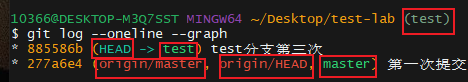

# 基本操作

## 1.git init 初始化仓库

在当前目录下创建一个名为.git的隐藏目录，将当前目录进行定义为git仓库，建议创建一个新目录并在里面进行此操作


## 2.git add 添加暂存区

完整命令为：

```shell
git add 文件名
```

- ==git add . 	全部添加==
- git add *.java     按文件类型添加
- 略

## 3. git status查看当前仓库状态

# 分支

## 1.指针

在git中,我们使用git checkout切换分支，git reset版本穿梭，实质上操作的是指针，不会对版本产生任何的影响，一旦产生commit提交必然会在当前的git仓库留下版本信息，只会影响指针的移动。



图中有五个指针：

(1) **HEAD**	

自己直接操纵的指针，可以指向分支指针也可以直接指向版本（夫人分离头指针）；从第一行框中部分可以看到HEAD指针指向test分支，从第三行可以看到HEAD指针指向test分支指针，而test指针指向885586b这个版本，类似`HEAD->test->885586b`的情况

如果

(2) **test**

test分支指针，该分支指向的是`85586b`版本。

(3) **master**

test分支指针，该分支指向的是`277a6e4`版本。

(4) **origin/master**

远端仓库指针，表示当前远端仓库版本的指向`277a6e4`版本。

(5) **origin/HEAD**

远端仓库头指针，指向277a6e4版本（属于游离头指针）。

==**注：**远端分支的移动只能通过git fetch移动，HEAD指针无法指向远端分支类似“可读不可写”。==

## 2.	git branch

### 2.1 查看分支

```sh
git branch --all -vv 	// （建议使用）查看远端分支和本地分支，以及关联情况，版本信息
git branch 		// 查看本地分支
git branch -vv 		// 查看分支关联情况
```


- master、test、origin/HEAD、origin/master、origin/test 五个分支
- 可以看到master分支与远端origin/master分支相关联
- 各个分支的版本、提交描述都能清晰看到

### 2.2 新建分支

```sh
git branch 分支名		// 新建分支，仅新建不会切换过去
git checkout -b 分支名		// 新建分支并切换到新建分支
```

### 2.3 删除分支

```sh
git branch -d 分支名		// 不能在当前分支下删除自己，需要先切换
```

### 2.4 关联远端分支

```sh
git branch --set-upstream-to=仓库/分支名		// 参数一般是origin/master这种格式，可关联多个远端仓库
git push -u 远端仓库/分支名		// 推送时顺便与当前分支关联
```

## 3.	git checkout 

操纵HEAD指针的指向

```sh
git checkout 分支名	// 把HEAD指针移动到该分支上
git checkout 版本号	// HEAD指针直接指向版本，变成分离头指针（少用）
```

**用法：**(1)`指向分支(常见)`

​		使用该命令使HEAD指向分支后，使用reset命令会把HEAD和分支一起移动


​			  (2)`指向版本`

==注：**HEAD无法指向远端仓库的分支，使用checkout切到远端分支会直接指向其对应的版本（会使其变成分离头指针）**==


## 4.	git reset

 操纵HEAD指针的指向，==如果HEAD指针当前指向分支，会带着分支一起移动==（HEAD无法通过checkout指向远端分支，故无法移动远端分支）

```sh
git reset --hard 版本号	
```

## 5.	git merge

操纵HEAD指针的版本和对应版本（常用分支间接指向版本）进行合并，合并后`HEAD`会移动到新版本上。（如果HEAD指向分支，会带着分支一起移动，和reset类似）

```sh
git merge 分支名|版本号	// 将目标分支
```

演示分离头指针的合并：


执行版本合并操作并查看log


发现合并后HEAD移动到了对应的885586b版本，而之前与HEAD在同一版本的master分支却不为所动，所以说git merge执行就是（版本合并，指针移动），如果HEAD指向分支会将分支带着一起移动。

## 6.	git log

查看指针（默认是HEAD指针）的版本迭代情况，类似“族谱”，一旦版本回退，那么也无法再通过此命令查看（reflog记录了HEAD的所有移动情况）。

```sh
git log --online --graph	// 显示HEAD指针的版本迭代，图+一行
git log --oneline --graph --all	// 所有指针都会显示（推荐）
```


## 7.	git reflog

保存着HEAD指针移动的信息，通过查看reflog日志可以获取到本地仓库所有的变化信息，因为本地仓库的任何操作都要基于HEAD指针进行的，只要指针有所移动就会留下日志信息。

一些版本没有指针指向，无法通过git log获取版本快照，就可以通过这条命令进行获取commit  id。

如图：分为三部分

1、版本快照:	b003dd6

2、在此版本上的指针：(HEAD, tag, origin/test)

3、进行的操作： reset: moving to b003

------


# 标签

tag是git版本库的一个标记，指向某个[commit](https://so.csdn.net/so/search?q=commit&spm=1001.2101.3001.7020)的==指针==，是一个点，是不可移动的。（分支是多个点连成一条线）

## 1.	创建标签

```sh
git tag <tagName> 	// 为当前版本创建本地tag

git tag -a 标签名 -m "标签描述"

git push origin <tagName> //推送到远程仓库

git push origin --tags	// 全部推到远程
```

## 2.	追加标签

在当前版本下给其他版本添加标签（默认是给当前版本添加标签），不用切换版本。

略

## 3.	删除标签

```sh
本地 tag 的删除：
git tag -d <tagName>

远程 tag 的删除：
git push origin:refs/tags/<tagName>
```

## 4.	查看标签

```sh
查看本地某个 tag 的详细信息：
git show <tagName>

查看本地所有 tag：
git tag 或者 git tag -l

查看远程所有 tag：
git ls-remote --tags origin
```

------


# 远端仓库

## git clone

创建文件夹将远端仓库给完整复制下来，文件夹内包含仓库内容和仓库必须的==.git文件==。默认保存着远端仓库的所有分支，存在一个本地分支master。

```sh
git clone url路径
```

## git fetch

远程跟踪分支已更新(Git术语叫做`commit`)，需要将这些更新取回本地，这时就要用到`git fetch`命令。


```sh
git fetch <branch URL><branch name>	// 获取一个特定的分支

git fetch -all	// 同时获取所有远端分支
```


## git pull


git pull = git fetch+git merge

```sh
git pull	// 分支关联后直接操作即可

```

注：如果进行了分支关联，不用指定分支，则在拉取与合并时自动与所关联的分支进行操作。

## git push

`git push`命令用于将本地分支的更新，推送到远程主机。它的格式与`git pull`命令相似。

```shell
$ git push <远程主机名> <本地分支名>:<远程分支名>	// 完整命令
$ git push origin	// 将当前分支推送到origin主机的对应分支
$ git push		// 将当前分支推送到所关联的分支
$ git push -u origin master		// 推送的同时建立起关联关系
```

1、删除远端分支

```sh
$ git push origin :master
# 等同于
$ git push origin --delete master
```

2、远端分支版本穿梭（默认版本不允许回退）

```sh
git push -f		// 需要与远端分支关联
```

# 特殊

## rebase

请注意，无论是通过变基，还是通过三方合并，整合的==最终结果所指向的快照始终是一样的==，只不过提交历史不同罢了。 变基是将一系列提交按照原有次序依次应用到另一分支上，而合并是把最终结果合在一起。

当前情况：存在两个分支


切换到mywork分支上执行

```sh
$ git checkout mywork
$ git rebase origin
```

效果如下：c5、c6分支被搬到master分支上，且作为最新提交


如果运行垃圾收集命令(pruning garbage collection), 这些被丢弃的提交就会删除.


## cherry-pick

